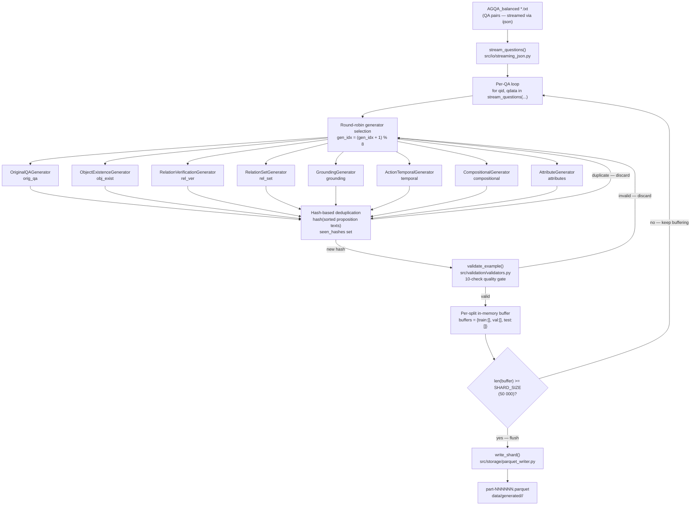
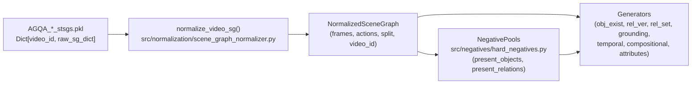

# UniProp — Architecture

> [!NOTE]
> UniProp is a **dataset engineering pipeline**, not a model. It contains zero
> inference or training code. Its sole purpose is to transform raw AGQA
> question-answer text and spatio-temporal scene graphs into proposition-based
> Parquet shards suitable for model training and benchmarking.

---

## 1. Overview

UniProp consumes two complementary sources from the
[AGQA v2](https://cs.stanford.edu/people/ranjaykrishna/agqa/) dataset:

| Input | Format | Description |
|---|---|---|
| `AGQA_balanced/train_balanced.txt` | JSON (streamed) | ~700 k QA pairs for training videos |
| `AGQA_balanced/test_balanced.txt` | JSON (streamed) | ~200 k QA pairs for test videos |
| `AGQA_train_stsgs.pkl` | Pickle | Spatio-temporal scene graphs for training videos |
| `AGQA_test_stsgs.pkl` | Pickle | Spatio-temporal scene graphs for test videos |

It produces a partitioned **Parquet dataset** under `data/generated/`:

```
data/generated/
├── train/
│   ├── part-000000.parquet   # up to 50 000 rows each
│   ├── part-000001.parquet
│   └── ...
├── val/
│   └── part-000000.parquet
└── test/
    └── part-000000.parquet
```

Each row is a **proposition group** — a video-query pair paired with a set of
natural-language candidate propositions, their binary ground-truth labels, and
rich metadata for evaluation slicing.

---

## 2. System Architecture Diagram

### 2.1 Full Data-Flow



### 2.2 Scene-Graph Path



---

## 3. Component Breakdown

### 3.1 IO Layer — `src/io/streaming_json.py`

| Symbol | Purpose |
|---|---|
| `stream_questions(file_path)` | Yields `(qid, qdata)` pairs lazily using `ijson.kvitems`. Keeps peak RAM proportional to one entry, not the full file. |

AGQA balanced files are single flat JSON objects (`{ "QID": {...}, ... }`).
Loading them fully with the standard `json` module would require several GB of
RAM. `stream_questions` avoids this by parsing incrementally.

---

### 3.2 Normalization — `src/normalization/scene_graph_normalizer.py`

Converts the heterogeneous raw pickle dicts into strongly-typed dataclasses.

| Dataclass | Description |
|---|---|
| `NormalizedObject` | One detected object in one frame: `id`, `class_id`, `name`, `visible`, `bbox` |
| `NormalizedRelation` | One directed relation between person and object: `id`, `type` (attention/contact/spatial/verb), `class_id`, `name`, `object_ids` |
| `NormalizedAction` | One temporal action segment: `id`, `charades_id`, `phrase`, `start_secs`, `end_secs`, `frame_ids`, `object_id`, `verb_id` |
| `NormalizedFrame` | One annotated video frame: `id`, `secs`, `objects` (dict), `relations` (list) |
| `NormalizedSceneGraph` | Top-level container for one video: `video_id`, `split`, `frames` (dict), `actions` (dict) |

**`normalize_video_sg(video_id, raw_sg)`** performs two passes:

1. **Pre-pass** — detects dataset `split` from frame metadata; builds all
   `NormalizedAction` objects.
2. **Main pass** — builds `NormalizedFrame` objects by parsing object vertices
   and embedded per-category relation lists (`attention`, `contact`, `spatial`,
   `verb`).

---

### 3.3 Negatives — `src/negatives/hard_negatives.py`

`NegativePools` scans every frame of a `NormalizedSceneGraph` at construction
time to build two sets:

| Attribute | Content |
|---|---|
| `present_objects` | `set[str]` of all object class IDs observed in any frame |
| `present_relations` | `set[tuple]` of `(family, class_id, target_object_id)` triples observed in any frame |

Three public query methods are used by generators:

| Method | Returns |
|---|---|
| `get_mutually_exclusive_relation(true_rel_class, target_obj, rng)` | A logically contradicting relation class (e.g. `r1` → `r2` = "not looking at") via `MUTUALLY_EXCLUSIVE_RELATIONS` |
| `get_closed_world_false_relation(true_rel_class, target_obj, rng)` | A relation from the same family that is not annotated for `target_obj` anywhere in the video |
| `get_false_object(rng)` | An object class ID absent from every frame of the video |

A rule-based `_is_compatible` filter blocks semantically nonsensical
combinations (e.g. "eating a window", "drinking a floor") before they reach
proposition text.

---

### 3.4 Generators — `src/generators/`

All generators inherit from `BaseGenerator` and implement a `generate(qid, qdata, sg, split, rng, pools)` method that yields zero or more `PropositionGroup` instances.

| Key | Class | Module | Reasoning Family | Description |
|---|---|---|---|---|
| `orig_qa` | `OriginalQAGenerator` | `original_qa.py` | `object` / mixed | Wraps the original AGQA QA pair as a binary or single-choice proposition. Requires no scene graph. |
| `obj_exist` | `ObjectExistenceGenerator` | `scene_graph.py` | `object` | Generates "Is [object] present?" binary/single-choice groups from scene-graph object inventories. |
| `rel_ver` | `RelationVerificationGenerator` | `scene_graph.py` | `spatial`, `attention`, `contact` | Generates "Is the person [relation] the [object]?" binary groups from annotated relation triples. |
| `rel_set` | `RelationSetGenerator` | `scene_graph.py` | `spatial`, `attention`, `contact` | Generates multi-label groups listing all relations between person and a specific object. |
| `grounding` | `GroundingGenerator` | `grounding.py` | `grounding` | Generates object identification (single-choice) and location verification (binary) groups with bounding-box evidence. |
| `temporal` | `ActionTemporalGenerator` | `temporal.py` | `temporal` | Generates single-hop and multi-hop temporal ordering propositions from Charades action segments. |
| `compositional` | `CompositionalGenerator` | `compositional.py` | `compositional` | Generates multi-hop propositions chaining two or more scene-graph relations or actions. |
| `attributes` | `AttributeGenerator` | `attributes.py` | `attribute` | Generates attribute (colour, size, state) verification propositions from scene-graph object annotations. |

---

### 3.5 Validation — `src/validation/validators.py`

`validate_example(group)` runs **10 sequential checks** and returns
`(is_valid: bool, errors: list[str])`. It never mutates the input.

| # | Check | Description |
|---|---|---|
| 1 | Proposition count range | `2 ≤ num_propositions ≤ 40` for non-`three_way` tasks |
| 2 | Three-way count | `three_way` tasks must have exactly 3 propositions |
| 3 | Label cardinality | `binary`, `single_choice`, `three_way` must have exactly 1 correct label |
| 4 | Query-to-task compatibility | `query_template_id` prefix must match reasoning type and task type |
| 5 | Semantic contradiction | Same canonical semantic signature cannot be both positive and negative |
| 6 | Mutual exclusivity | Relations in `MUTUALLY_EXCLUSIVE_RELATIONS` cannot both be TRUE |
| 7 | Temporal consistency | Cyclic or contradictory `before`/`after` orderings are rejected |
| 8 | NONE proposition consistency | `logical_none` correctness must be consistent with other labels |
| 9 | Duplicate text | All proposition texts within a group must be distinct |
| 10 | Surface-form quality | Rejects empty text, unresolved IDs (`o012`, `r03`), known bad-grammar patterns, double negations |

---

### 3.6 Storage — `src/storage/parquet_writer.py`

`write_shard(groups, out_path)` flattens a list of `PropositionGroup` objects
into eleven parallel columns and writes a single Parquet file via PyArrow.

- Enforces a **fixed, strictly-typed PyArrow schema** so all shards are
  schema-identical regardless of Python runtime types.
- Asserts that `video_id` is non-null and non-empty before writing.
- Uses PyArrow's default Snappy compression.
- Returns `None`; raises `AssertionError` on missing `video_id`.

---

### 3.7 Reasoning Subsystem — `src/reasoning/`

| Module | Purpose |
|---|---|
| `semantic_types.py` | Defines the canonical semantic type taxonomy (`canonical_type` values) |
| `semantic_engine.py` | Evaluates a proposition's truth value against a `NormalizedSceneGraph` |
| `canonicalization.py` | Maps raw AGQA question programs and scene-graph predicates to canonical semantic types |
| `program_parser.py` | Parses AGQA functional programs (DSL) into an AST for truth evaluation |
| `program_evaluator.py` | Evaluates AGQA program ASTs against scene-graph state |
| `evidence.py` | Extracts and packages evidence object/relation/frame IDs from the scene graph for provenance |

---

### 3.8 CLI — `src/cli/main.py`

Thin Click/argparse wrapper around `main_pipeline.py`. Allows configuring the
target example count, output directory, and random seed without editing the
pipeline source.

---

## 4. Data Flow — Step-by-Step

```
 1. SEED = 42 set globally; PYTHONHASHSEED exported for deterministic hashing.

 2. Eight generators are instantiated and stored in a fixed-order list.

 3. AGQA_train_stsgs.pkl and AGQA_test_stsgs.pkl are loaded with pickle.
    Result: Dict[video_id → raw_scene_graph_dict].

 4. Training video IDs are shuffled (seeded). First 10% → val_vids set;
    remaining 90% → train_vids_set. test_vids loaded from test pkl.

 5. Checkpoint scan: existing part-*.parquet shards in data/generated/<split>/
    are read (propositions column only). Each group's sorted-text hash is added
    to seen_hashes. shard_indices[split] is advanced past existing shard numbers.

 6. process_split(train_balanced.txt, train_sgs_raw, is_test_set=False, target):
    a. normalize_video_sg() called for every video → sgs_norm dict.
    b. NegativePools() built for every video → pools_cache dict.
    c. stream_questions() streams (qid, qdata) pairs lazily.
    d. For each QA pair:
       i.   Resolve video_id → split via get_split().
       ii.  Look up pre-computed NormalizedSceneGraph and NegativePools.
       iii. Round-robin: try up to 8 generators (gen_idx advances modulo 8).
       iv.  For each candidate PropositionGroup yielded:
            - Compute hash(sorted(p.text for p in group.propositions)).
            - If hash in seen_hashes → duplicate_count++ → skip.
            - Else: add hash to seen_hashes.
            - Call validate_example(group).
            - If invalid → rejected[gen_name]++ → record error codes → skip.
            - If valid:
              * accepted[gen_name]++; generated_count++; total_accepted++.
              * Append to buffers[split].
              * Call flush_buffer(split, force=False) → write shard if full.
              * Update all stats counters (task_type, reasoning_family, etc.).
    e. Loop ends when generated_count >= target_count or questions exhausted.

 7. process_split(test_balanced.txt, test_sgs_raw, is_test_set=True, target).
    Same logic; routes all examples to the test split.

 8. Teardown:
    - flush_buffer(split, force=True) for all splits (partial buffers).
    - Five consistency assertions on stats totals.
    - Four Markdown reports written: SAMPLE_REPORT.md, VALIDATION_REPORT.md,
      SPLIT_REPORT.md, DIVERSITY_REPORT.md.
```

---

## 5. Generator Round-Robin

The pipeline maintains a single integer `gen_idx` (initially 0) that persists
across **all** QA questions in a given `process_split` call.

```python
for qid, qdata in stream_questions(qs_path):
    for _ in range(len(generators)):          # try up to 8 generators
        gen_name, gen_obj = generators[gen_idx]
        gen_idx = (gen_idx + 1) % len(generators)
        for group in gen_obj.generate(...):
            ...                               # accept/reject, then break inner
```

**Key properties:**

- Each QA item gets **at most one attempt per generator** per outer iteration.
- `gen_idx` is **not reset** between questions, so the starting generator
  rotates naturally across the question stream, preventing any single generator
  from consuming a disproportionate share of examples.
- If `generated_count >= target_count` is reached mid-loop, the inner and
  outer loops both break immediately.
- A generator that yields nothing for a given QA item simply contributes 0
  candidates; `gen_idx` still advances.

The eight generators in fixed registration order are:

```
0: orig_qa         4: grounding
1: obj_exist       5: temporal
2: rel_ver         6: compositional
3: rel_set         7: attributes
```

---

## 6. Deduplication Strategy

UniProp uses **content-addressed hashing** to prevent the same proposition
group from appearing more than once in the output dataset.

### 6.1 Fingerprint computation

```python
group_hash = hash("".join(sorted(p.text for p in group.propositions)))
```

The proposition texts are **sorted** (order-independent) and concatenated
before hashing so that two groups with identical propositions but different
internal orderings produce the same fingerprint.

### 6.2 `seen_hashes` set

A single `set` is maintained for the entire run:

- Populated at startup from **checkpoint shards** (Phase 5).
- Extended immediately when a candidate passes the hash check (before
  validation), so that even groups that subsequently fail validation cannot
  produce duplicates later.

### 6.3 Duplicate accounting

Every rejected duplicate increments `stats["duplicate_count"]`. The
`DIVERSITY_REPORT.md` reports the **duplicate catch ratio**
(`duplicate_count / total_candidates`) as a data-quality metric.

### 6.4 Interaction with checkpointing

When the pipeline restarts after an interruption, Phase 5 reads only the
`propositions` column from existing shards and re-populates `seen_hashes`.
No example already on disk can be regenerated.

---

## 7. Checkpoint / Resume

The pipeline is designed to be **safely interrupted and restarted**:

```
Startup
  │
  ├─ for split in [train, val, test]:
  │    for file in sorted(data/generated/<split>/part-*.parquet):
  │      idx = int(file.replace("part-","").replace(".parquet",""))
  │      shard_indices[split] = max(shard_indices[split], idx + 1)
  │      table = pq.read_table(file, columns=["propositions"])
  │      for row in table["propositions"].to_pylist():
  │        seen_hashes.add(hash("".join(sorted(texts))))
  │        written_count += 1
  │
  └─ generated_count = written_count   ← count resumes from disk
```

After checkpoint loading:

- `shard_indices[split]` is advanced past all existing shard numbers so new
  shards never overwrite old ones.
- `generated_count` starts at `written_count`, so `target_count` arithmetic
  (the loop break condition) correctly accounts for already-generated examples.
- `seen_hashes` prevents any on-disk example from being regenerated.

> [!IMPORTANT]
> Checkpoint loading reads only the `propositions` column to minimise I/O.
> All other columns (labels, metadata, etc.) are not needed for deduplication.

---

## 8. Shard Architecture

| Property | Value |
|---|---|
| `SHARD_SIZE` | `50 000` rows per shard |
| Filename pattern | `part-NNNNNN.parquet` (zero-padded 6-digit index) |
| Output root | `<DATA_ROOT>/data/generated/<split>/` |
| Compression | Snappy (PyArrow default) |
| Schema | Fixed 11-column PyArrow schema (see DATA_SCHEMA.md) |

**Flush logic (`flush_buffer`):**

- Called after every accepted group with `force=False`.
- Writes only when `len(buffers[split]) >= SHARD_SIZE` (or `force=True`).
- On success: buffer is cleared; `shard_indices[split]` incremented.
- On exception: error is logged; buffer is **not** cleared (retry on next call).
- After both generation passes complete, `flush_buffer(split, force=True)` is
  called for all three splits to write any partial buffer.

---

## 9. Design Principles

### No model code
UniProp contains no inference, training, or embedding code. It is a
**pure data-engineering pipeline**: AGQA QA text in, Parquet propositions out.

### Raw text only
Proposition texts are generated entirely from string templates and
scene-graph labels. No external APIs, no neural text generators, no
pre-trained embeddings.

### Strict schema
Every output shard shares an identical PyArrow schema (11 columns, fixed
types). `write_shard` enforces this schema explicitly rather than inferring
it from Python types, making shards directly concatenable with PyArrow or
DuckDB.

### Provenance tracking
Every `PropositionGroup` carries a `Provenance` instance that records the
source QA ID, question text, answer, scene graph ID, generation rule,
generation seed, evidence object/relation/frame IDs, and generator family.
Any generated example can be traced back to its exact source material.

### Reproducibility
- `SEED = 42` is set globally.
- `PYTHONHASHSEED` is exported to make Python's `hash()` deterministic.
- A seeded `random.Random(SEED)` instance (`rng`) is passed explicitly to all
  generators and sampling functions.
- The 90/10 train/val split is produced by a seeded shuffle and is therefore
  identical across runs.

### Fault tolerance
- Shard writes are wrapped in `try/except`; failures are logged but do not
  abort the pipeline.
- Checkpoint/resume means a crashed run loses at most `SHARD_SIZE - 1` rows
  (those in the unflushed buffer at crash time).
